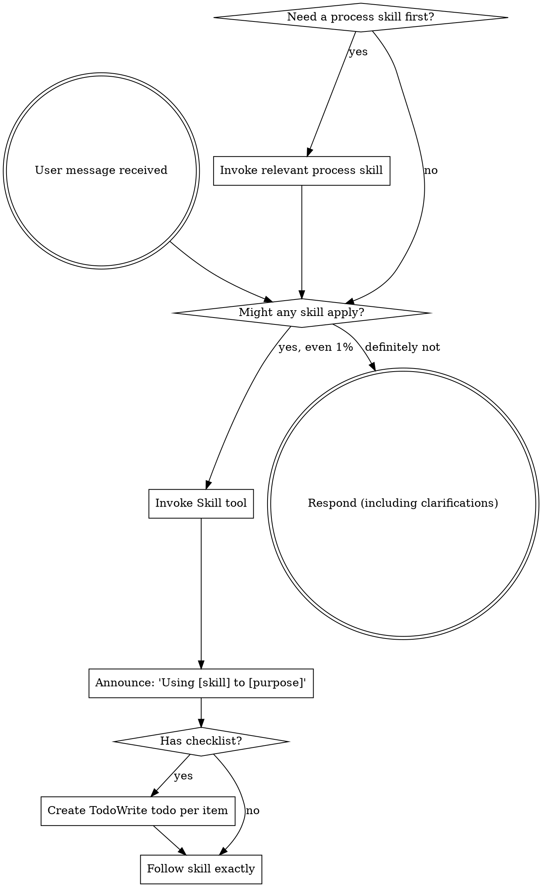

<SUBAGENT-STOP>
If you were dispatched as a subagent to execute a specific task, skip this skill.
</SUBAGENT-STOP>

<EXTREMELY-IMPORTANT>
If you think there is even a 1% chance a skill might apply to what you are doing, you ABSOLUTELY MUST invoke the skill.

IF A SKILL APPLIES TO YOUR TASK, YOU DO NOT HAVE A CHOICE. YOU MUST USE IT.

This is not negotiable. This is not optional. You cannot rationalize your way out of this.
</EXTREMELY-IMPORTANT>

## Instruction Priority

Superpowers skills override default system prompt behavior, but **user instructions always take precedence**:

1. **User's explicit instructions** (CLAUDE.md, GEMINI.md, AGENTS.md, direct requests) — highest priority
2. **Superpowers skills** — override default system behavior where they conflict
3. **Default system prompt** — lowest priority

If CLAUDE.md, GEMINI.md, or AGENTS.md says "don't use TDD" and a skill says "always use TDD," follow the user's instructions. The user is in control.

## How to Access Skills

**In Claude Code:** Use the `Skill` tool. When you invoke a skill, its content is loaded and presented to you—follow it directly. Never use the Read tool on skill files.

**In Copilot CLI:** Use the `skill` tool. Skills are auto-discovered from installed plugins. The `skill` tool works the same as Claude Code's `Skill` tool.

**In Gemini CLI:** Skills activate via the `activate_skill` tool. Gemini loads skill metadata at session start and activates the full content on demand.

**In other environments:** Check your platform's documentation for how skills are loaded.

## Platform Adaptation

Skills use Claude Code tool names. Non-CC platforms: see `references/copilot-tools.md` (Copilot CLI), `references/codex-tools.md` (Codex) for tool equivalents. Gemini CLI users get the tool mapping loaded automatically via GEMINI.md.

---

# Always-Active Disciplines

These Iron Laws are ALWAYS in effect. You do not need to invoke a skill to follow them — they apply to every action you take. The full skills remain available via the Skill tool for detailed process guidance when needed.

## Iron Law: Test-Driven Development

```
NO PRODUCTION CODE WITHOUT A FAILING TEST FIRST
```

Follow the Red-Green-Refactor cycle for all new features, bug fixes, and behavior changes:
1. **RED** — Write one minimal failing test. Clear name, tests real behavior, one thing.
2. **Verify RED** — Run it. Confirm it fails because the feature is missing, not a typo.
3. **GREEN** — Write the simplest code to pass. No over-engineering.
4. **Verify GREEN** — Run full suite. All tests pass, output pristine.
5. **REFACTOR** — Clean up. Keep tests green.

Wrote code before the test? Delete it. Start over. No exceptions.

For the full process: invoke `superpowers:test-driven-development`

## Iron Law: Verification Before Completion

```
NO COMPLETION CLAIMS WITHOUT FRESH VERIFICATION EVIDENCE
```

Before ANY claim of success, completion, or correctness:
1. **IDENTIFY** — What command proves this claim?
2. **RUN** — Execute the full command fresh.
3. **READ** — Full output, check exit code, count failures.
4. **VERIFY** — Does output confirm the claim?
5. **ONLY THEN** — Make the claim with evidence.

Using "should work", "probably passes", "seems correct"? STOP. Run the command.

For the full process: invoke `superpowers:verification-before-completion`

## Iron Law: Systematic Debugging

```
NO FIXES WITHOUT ROOT CAUSE INVESTIGATION FIRST
```

For ANY bug, test failure, or unexpected behavior — complete these phases in order:
1. **Root Cause** — Read errors carefully, reproduce, check recent changes, trace data flow.
2. **Pattern Analysis** — Find working examples, compare, identify differences.
3. **Hypothesis** — Form single hypothesis, test minimally, one variable at a time.
4. **Implementation** — Create failing test, implement single fix, verify.

If 3+ fixes have failed: STOP. Question the architecture. Discuss before attempting more.

For the full process: invoke `superpowers:systematic-debugging`

## Iron Law: Autonomous Review

After completing implementation work, ALWAYS request code review before claiming done:
1. Get git SHAs for the changed range.
2. Dispatch `superpowers:code-reviewer` subagent with the review template.
3. Act on feedback: fix Critical immediately, fix Important before proceeding.
4. When receiving review feedback, verify before implementing — no performative agreement.

For review templates: invoke `superpowers:requesting-code-review`
For handling feedback: invoke `superpowers:receiving-code-review`

---

# Mode-Aware Skill Routing

## Plan Mode Only

These skills MUST ONLY be invoked during plan mode. Do NOT invoke them during implementation:
- `superpowers:brainstorming` — design exploration and spec writing
- `superpowers:writing-plans` — detailed implementation plan creation

If you are NOT in plan mode and think you need to brainstorm or write a plan, proceed directly to implementation instead. The user will enter plan mode explicitly when they want planning.

## Post-Plan-Mode Behavior

After exiting plan mode, proceed directly to implementation or debugging. Do NOT:
- Generate additional design documents or specs
- Write more plans
- Invoke brainstorming or writing-plans
- Ask about execution strategy choices

The plan was already created. Execute it now.

## Worktree Auto-Detection

If you are working in a git worktree (check: `git rev-parse --git-common-dir` differs from `git rev-parse --git-dir`), then after implementation is complete and all tests pass, automatically invoke `superpowers:finishing-a-development-branch`. Do not ask whether to invoke it — just invoke it.

If you are NOT in a worktree, do not invoke finishing-a-development-branch unless the user asks.

---

# Using Skills

## The Rule

**Invoke relevant or requested skills BEFORE any response or action.** Even a 1% chance a skill might apply means that you should invoke the skill to check. If an invoked skill turns out to be wrong for the situation, you don't need to use it.



## Red Flags

These thoughts mean STOP—you're rationalizing:

| Thought | Reality |
|---------|---------|
| "This is just a simple question" | Questions are tasks. Check for skills. |
| "I need more context first" | Skill check comes BEFORE clarifying questions. |
| "Let me explore the codebase first" | Skills tell you HOW to explore. Check first. |
| "I can check git/files quickly" | Files lack conversation context. Check for skills. |
| "Let me gather information first" | Skills tell you HOW to gather information. |
| "This doesn't need a formal skill" | If a skill exists, use it. |
| "I remember this skill" | Skills evolve. Read current version. |
| "This doesn't count as a task" | Action = task. Check for skills. |
| "The skill is overkill" | Simple things become complex. Use it. |
| "I'll just do this one thing first" | Check BEFORE doing anything. |
| "This feels productive" | Undisciplined action wastes time. Skills prevent this. |
| "I know what that means" | Knowing the concept ≠ using the skill. Invoke it. |

## Skill Priority

When multiple skills could apply, use this order:

1. **Process skills first** (systematic-debugging, test-driven-development) - these determine HOW to approach the task
2. **Verification skills second** (verification-before-completion) - these gate completion claims
3. **Review skills third** (requesting-code-review, receiving-code-review) - these guide peer review

"Fix this bug" → systematic-debugging first, then test-driven-development for code changes, then verification-before-completion before claiming done.
"Add a feature" → test-driven-development, then verification-before-completion, then requesting-code-review.

## Skill Types

**Rigid** (TDD, debugging): Follow exactly. Don't adapt away discipline.

**Flexible** (patterns): Adapt principles to context.

The skill itself tells you which.

## User Instructions

Instructions say WHAT, not HOW. "Add X" or "Fix Y" doesn't mean skip workflows.
